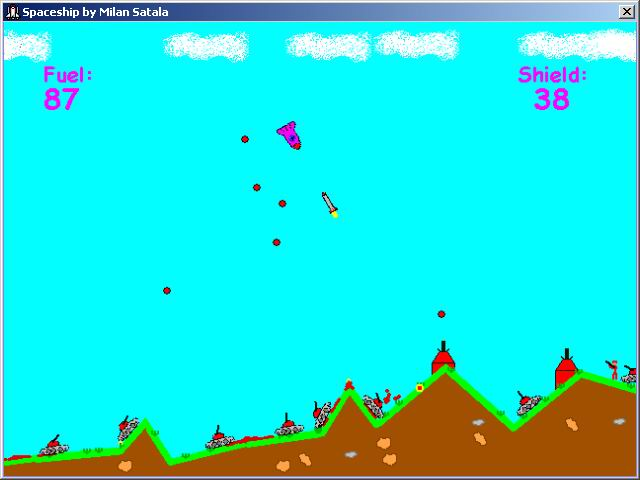



## Spaceship \- full game

### Description

You controll a spaceship. You fight against a large ammount of enemies. Game is not a tutorial or something like that (source is not commented) so you won't learn anything. Becouse of this I had a free hand creating it so it is quite funny. However I spent just one weekend working on it so it doesn't have many levels and you should be able to finish it in less than hour. I used the engine from my older game Lander (also here on PSC). Have fun !

PS: Don't forget to read readme.txt becouse the game is quite complex and you might have problems playing it.
 
### More Info
 

             |
---                |---
**Submitted On**   |2003-12-14 13:32:58
**By**             |[Milan Satala](https://github.com/Planet-Source-Code/PSCIndex/blob/master/ByAuthor/milan-satala.md)
**Level**          |Advanced
**User Rating**    |5.0 (65 globes from 13 users)
**Compatibility**  |VB 6\.0
**Category**       |[Games](https://github.com/Planet-Source-Code/PSCIndex/blob/master/ByCategory/games__1-38.md)
**World**          |[Visual Basic](https://github.com/Planet-Source-Code/PSCIndex/blob/master/ByWorld/visual-basic.md)
**Archive File**   |[Spaceship\_16841212152003\.zip](https://github.com/Planet-Source-Code/milan-satala-spaceship-full-game__1-50470/archive/master.zip)

